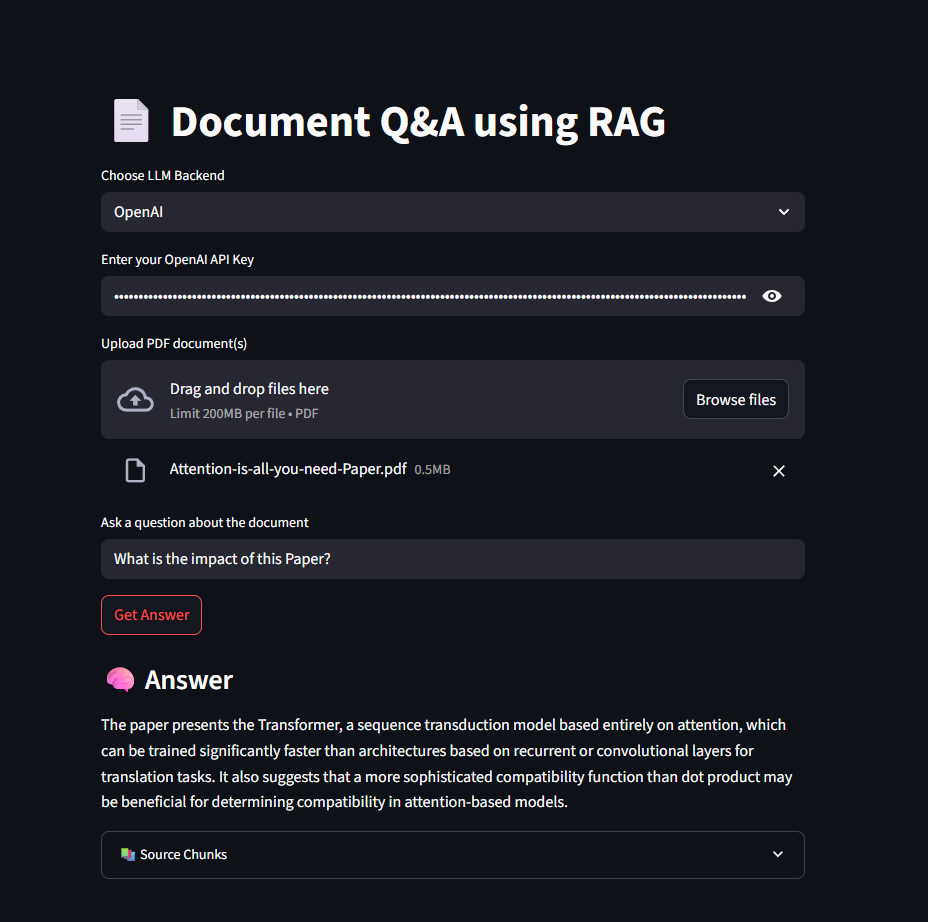

# 📄 Document Q&A using RAG

This project is a **Streamlit-based Document Question-Answering (Q&A)** system powered by **Retrieval-Augmented Generation (RAG)**. It allows users to upload PDFs and ask questions about their content using either **OpenAI** or **Ollama (local LLMs)**.

---

## 🚀 Features

- 🔍 Extracts and chunks content from uploaded PDFs
- 🤖 Choose between OpenAI API or local Ollama models
- 🔐 Secure API key input (OpenAI)
- 📚 Shows source document chunks for transparency
- 💬 Exit gracefully by typing `"goodbye"`

---

## 🧠 Interface

### ✅ OpenAI Mode

- API key entry
- Upload PDFs
- Ask questions



### ✅ Ollama Mode

- Lists locally installed Ollama models
- Lets you select one and query uploaded PDFs


---

## 🧩 How It Works

1. **Upload PDF** via Streamlit file uploader
2. **Text Extraction** using `PyMuPDF (fitz)`
3. **Chunking** using LangChain's `CharacterTextSplitter`
4. **Embeddings** generated with:
   - `OpenAIEmbeddings` for OpenAI
   - `HuggingFaceEmbeddings` for Ollama
5. **Vector store** built using FAISS
6. **QA Chain** using LangChain’s `RetrievalQA`

---

## 🛠 Requirements

Install all dependencies using:

```bash
pip install -r requirements.txt
```

> Alternatively, use Pipenv:
```bash
pipenv install
pipenv shell
```

Then run:

```bash
streamlit run app.py
```

---

## 📁 Project Structure

```
📁 Document Intelligence with RAG/
├── app.py
├── requirements.txt
├── images/
│   ├── OpenAI_API_RAG.png
│   └── local_ollama.png
└── ...
```

---

## 🖼 How to Add Screenshots

1. Create a folder named `images/` in your project root.
2. Save your screenshots in that folder.
3. Reference them in the Markdown like this:
   ```markdown
   
   ```

---

## 🧨 Troubleshooting

- ❌ **Ollama not installed**: Follow [Ollama's installation guide](https://ollama.com)
- ❌ **No Ollama models**: Run `ollama pull llama2`, `mistral`, etc.
- ❌ **streamlit not found**: Activate environment via `pipenv shell` or install globally

---

## 💡 Example Questions

- "What is the main idea of the document?"
- "Summarize Section 2"
- "Who are the authors?"